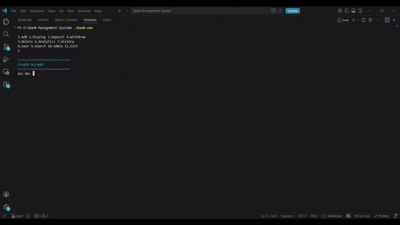
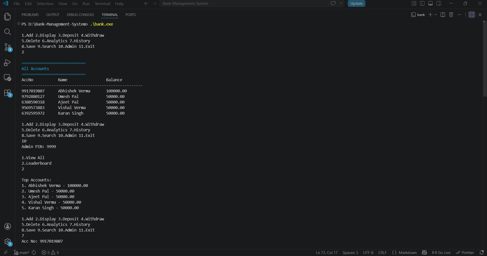
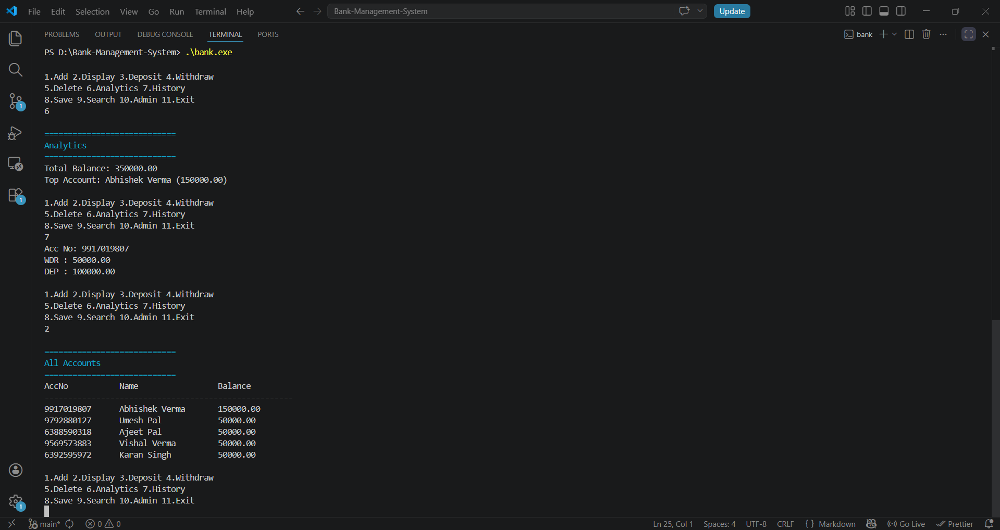
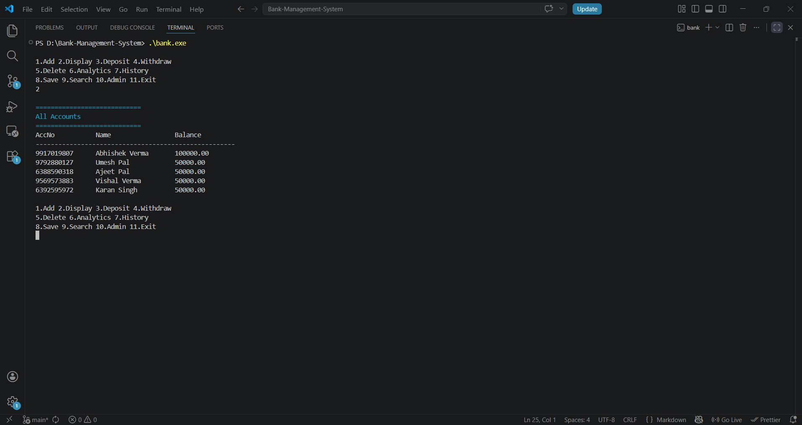

# 🏦 Bank Management System

  <b>⚡ Console-based banking system built in C using Linked List & File Handling</b>

---

## 🎬 Demo Preview

  

> 💡 *Tip: Keep GIF under 10MB or GitHub will reject it*

---

## 🚀 Features

- ➕ Create Account (supports full name input)
- 📄 Display All Accounts (clean table format)
- 💰 Deposit & Withdraw system
- ❌ Delete Account
- 📊 Analytics Dashboard (Total balance, account count)
- 🕓 Transaction History
- 💾 Persistent Storage using `bank.dat`
- 🔐 Admin PIN Protection

---

## 🧠 Core Concepts Used

| Concept            | Implementation |
|------------------|--------------|
| Linked List       | Dynamic account storage |
| File Handling     | Binary read/write (`fread`, `fwrite`) |
| Structures        | Account data modeling |
| Modular Code      | Multiple `.c` & `.h` files |
| Pointer Handling  | Node linking & traversal |

---

## 📸 Screenshots

### 🧾 Main Menu

  

### 📊 Analytics View

  

### 📄 Account Display

  

---

## 📂 Project Structure

## 📂 Project Structure

### 🔹 Source Files
- `main.c`
- `account.c / account.h`
- `file.c / file.h`
- `ui.c / ui.h`
- `utils.c / utils.h`

### 🖼 Assets
- `assets/menu.png`
- `assets/analytics.png`
- `assets/display.png`
- `assets/demo.gif`

### 📁 Other Files
- `bank.dat`
- `README.md`

---

## ⚙️ Installation & Run

### 🔧 Compile

gcc main.c account.c file.c ui.c utils.c -o bank

---

👨‍💻 Author
### Abhishek Verma